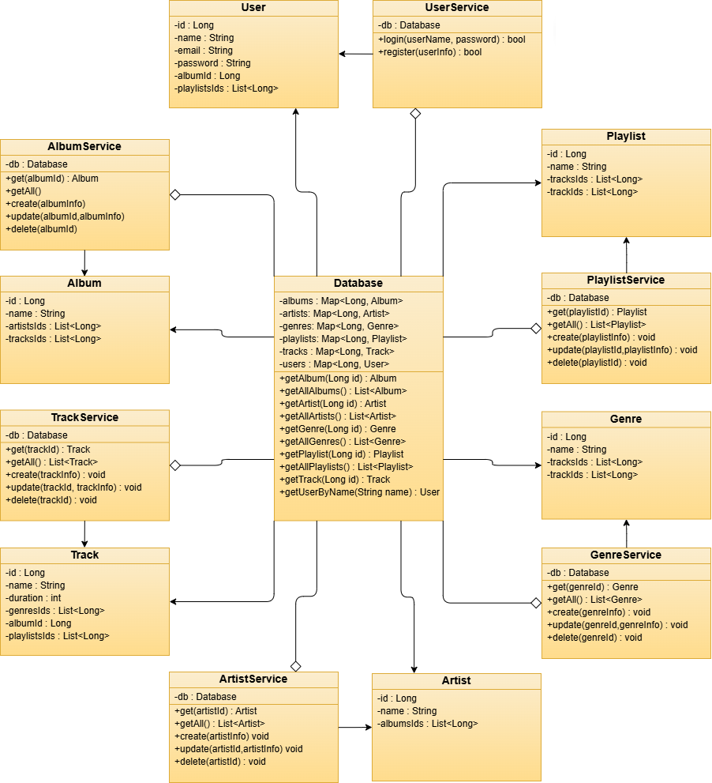
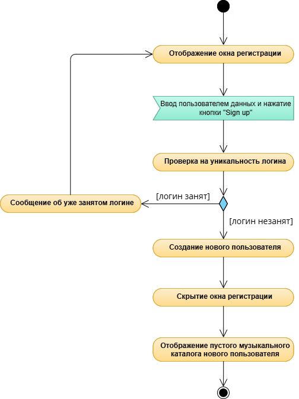
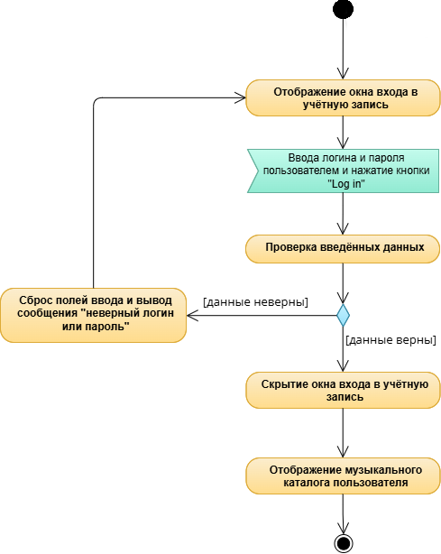
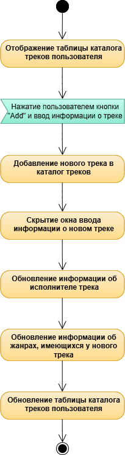
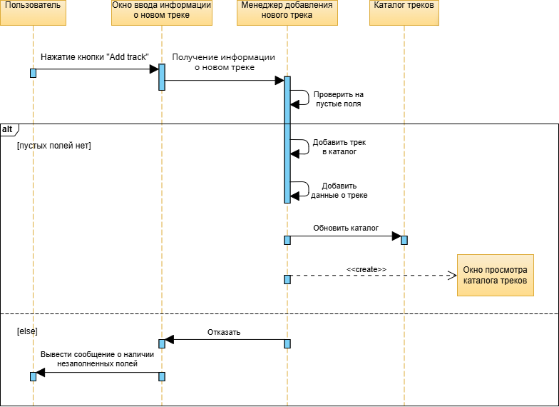
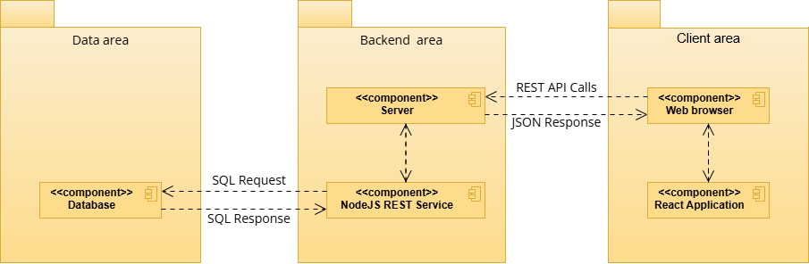

### 1 Диаграмма классов:

### 2 Диаграммы активностей:

Регистрация: 

Авторизация: 

Добавление трека: 

### 3 Диаграмма последовательностей:

### 4 Диаграмма состояний:

### 5 Диаграмма компонентов:

### 6 Диаграмма использований:

