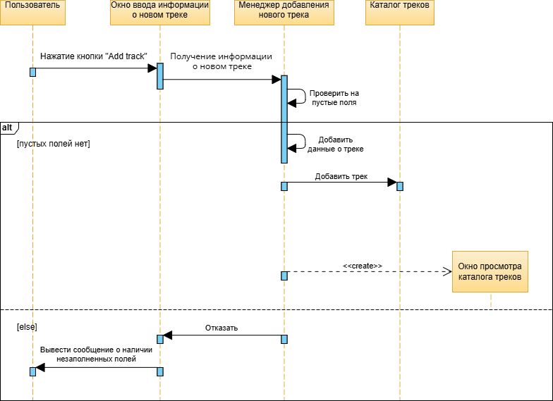

# Содержание
1 [Диаграмма классов](#classes)  
2 [Диаграммы активностей](#activities)  
2.1 [Регистрация](#sign_up_activity)  
2.2 [Авторизация](#log_in_activity)  
2.3 [Добавление трека](#add_track_activity)  
3 [Диаграммы последовательностей](#sequences)  
3.1 [Регистрация](#sign_up_sequence)  
3.2 [Авторизация](#log_in_sequence)  
3.3 [Добавление трека](#add_track_sequence)  
4 [Диаграммы состояний](#states)  
4.1 [Регистрация](#sign_up_state)  
4.2 [Авторизация](#log_in_state)  
4.3 [Работа с треками](#track_work_state)  
5 [Диаграмма компонентов](#components)  
6 [Диаграмма использований](#use_case)  
7 [Глоссарий](#glossary)  
8 [Поток событий](#flow_of_events)  
8.1 [Авторизоваться](#log_in_event)  
8.2 [Зарегистрироваться](#sign_up_event)  
8.3 [Просмотреть каталог треков](#view_track_catalog_event)  
8.4 [Добавить трек](#add_track_event)  
8.5 [Изменить информацию о треке](#edit_track_event)  
8.6 [Удалить трек](#remove_track_event)   

<a name="classes"/>

# 1 Диаграмма классов

<a name="activities"/>

# 2 Диаграммы активностей

<a name="sign_up_activity"/>

## 2.1 Регистрация

<a name="log_in_activity"/>

## 2.2 Авторизация

<a name="add_track_activity"/>

## 2.3 Добавление трека

<a name="sequences"/>

# 3 Диаграммы последовательностей

<a name="sign_up_sequence"/>

## 3.1 Регистрация

<a name="log_in_sequence"/>

## 3.2 Авторизация

<a name="add_track_sequence"/>

## 3.3 Добавление трека

<a name="states"/>

# 4 Диаграммы состояний

<a name="sign_up_state"/>

## 4.1 Регистрация

<a name="log_in_state"/>

## 4.2 Авторизация

<a name="track_work_state"/>

## 4.3 Работа с треками

<a name="components"/>

# 5 Диаграмма компонентов

<a name="use_case"/>

# 6 Диаграмма использований

<a name="glossary"/>

# 7 Глоссарий

| Термин                        | Определение                                                                                                                 |
|:------------------------------|:----------------------------------------------------------------------------------------------------------------------------|
| Пользователь                  | Человек, использующий приложение 												                                                                               |
| Авторизированный пользователь | Пользователь, который авторизовался в приложении   									                                                                |
| Посетитель                    | Пользователь, использующий приложение без авторизации 									                                                             |  
| Музыкальный каталог           | Список треков, исполнителей, альбомов, жанров и плейлистов, находящихся в личной коллекции зарегистрированного пользователя |
| Сигма                         | Буква греческого алфавита 													                                                                                     |

<a name="flow_of_events"/>

# 8. Поток событий

<a name="log_in_event"/>

## 8.1 Авторизоваться

**Описание.** Вариант использования "Авторизоваться" позволяет пользователю войти в учётную запись.  
**Основной поток.**
1. Приложение отображает окно входа в учётную запись;
2. Пользователь вводит свой логин и пароль;
3. Пользователь нажимает кнопку "ОК";
4. Приложение проверяет, есть ли пользователь с таким логином и подходит ли пароль. Если проверка не пройдена, выполняется альтернативный поток А1;
5. Приложение скрывает окно входа в учётную запись;
6. Вариант использования завершается.

**Альтернативный поток А1.**
1. Приложение отображает окно с сообщением о том, что данные не подходят;
2. Возврат к п.2 основного потока.

**Дополнительная информация.** Пользователь имеет возможность перейти в окно регистрации, нажав "SignUp". В этом случае выполняется альтернативный поток А2.

**Альтернативный поток А2.**
1. Приложение скрывает окно авторизации;
2. Выполняется вариант использования "[Зарегистрироваться](#sign_up_event)".

**Постусловия.** Выполняется вариант использования "[Просмотреть каталог треков](#view_track_catalog_event)".

<a name="sign_up_event"/>
 
## 8.2 Зарегистрироваться

**Описание.** Вариант использования "Зарегистрироваться" позволяет пользователю создать свою учётную запись в приложении.  
**Предусловия.** Пользователь выбрал способ "Sign up" в окне авторизации.
**Основной поток.**
1. Приложение отображает окно регистрации, в котором запрашивает у пользователя ввод имени, логина и пароля;
2. Пользователь вводит своё имя, логин и пароль;
3. Пользователь нажимает кнопку "ОК";
4. Приложение проверяет введённый логин на совпадение с уже зарегистрированными пользователями. Если совпадение выявлено, выполняется альтернативный поток А3;
5. Приложение добавляет в базу данных нового пользователя;
6. Приложение скрывает окно регистрации;
7. Вариант использования завершается.

**Альтернативный поток А3.**
1. Приложение сообщает пользователю, что пользователь с таким логином уже существует;
2. Приложение запрашивает у пользователя ввод другого логина;
3. Возврат к п.2 основного потока.

**Дополнительная информация.** Пользователь имеет возможность перейти в окно авторизации, нажав "LogIn". В этом случае выполняется альтернативный поток А4.

**Альтернативный поток А4.**
1. Приложение скрывает окно регистрации;
2. Выполняется вариант использования "[Авторизоваться](#log_in_event)".

**Постусловия.** Выполняется вариант использования "[Просмотреть каталог треков](#view_track_catalog_event)".

<a name="view_track_catalog_event"/>
  
## 8.3 Просмотреть каталог треков

**Описание.** Вариант использования "Просмотреть каталог треков" загружает информацию пользователя из базы данных.  
**Предусловия.** Пользователь авторизовался или зарегистрировался.  
**Основной поток.**
1. Приложение получает список треков пользователя из базы данных;
2. Приложение отображает треки из списка в таблице главного окна приложения; 
3. Вариант использования завершается.

<a name="add_track_event"/>

## 8.4 Добавить трек

**Описание.** Вариант использования "Добавить трек" позволяет авторизированному пользователю добавить новый трек в его каталог.  
**Предусловия.** Авторизированный пользователь нажал на кнопку "Add track".  
**Основной поток.**
1. Приложение отображает окно ввода данных о новом треке;
2. Пользователь вводит данные о новом треке;
3. Приложение проверяет, заполнены ли все поля данных. Если есть незаполненные поля, выполняется альтернативный поток А5;
4. Приложение добавляет новый трек в базу данных;
5. Приложение закрывает окно ввода информации о новом треке;
6. Приложение обновляет отображаемый каталог треков;
7. Вариант использования завершается.

**Альтернативный поток А5.**
1. Приложение сообщает пользователю о незаполненных полях данных;
2. Возврат к п.2 основного потока.

**Постусловия.** Выполняется вариант использования "[Просмотреть каталог треков](#view_track_catalog_event)".

<a name="edit_track_event"/>
 
## 8.5 Изменить информацию о треке 

**Описание.** Вариант использования "Изменить информацию о треке" позволяет авторизированному пользователю изменить информацию о треке из его каталога.  
**Предусловия.** Авторизированный пользователь нажал на кнопку редактирования напротив выбранного трека.  
**Основной поток.**
1. Приложение отображает окно изменения данных о треке;
2. Пользователь вводит изменённую информацию о треке;
3. Пользователь нажимает кнопку "Edit". Если пользователь нажимает кнопку "Cancel" выполняется альтернативный поток А6;
4. Приложение скрывает окно изменения данных о треке;
5. Приложение изменяет информацию о треке в базе данных;
6. Приложение обновляет отображаемый каталог треков;
7. Вариант использования завершается.

**Альтернативный поток А6.**
1. Приложение скрывает изменения данных о треке;
2. Вариант использования завершается.

**Постусловия.** Выполняется вариант использования "[Просмотреть каталог треков](#view_track_catalog_event)".

<a name="remove_track_event"/>

## 8.6 Удалить трек

**Описание.** Вариант использования "Удалить трек" позволяет авторизированному пользователю удалить трек из его каталога.  
**Предусловия.** Авторизированный пользователь нажал на кнопку удаления напротив удаляемого трека.  
**Основной поток.**
1. Приложение отображает окно подтверждения удаления трека;
2. Пользователь нажимает кнопку "Delete". Если пользователь нажимает кнопку "Cancel", выполняется альтернативный поток А7;
3. Приложение скрывает окно подтверждения удаления;
4. Приложение удаляет выбранный трек из базы данных;
5. Приложение обновляет отображаемый каталог треков;
6. Вариант использования завершается.

**Альтернативный поток А7.**
1. Приложение скрывает окно подтверждения удаления;
2. Вариант использования завершается.

**Постусловия.** Выполняется вариант использования "[Просмотреть каталог треков](#view_track_catalog_event)".

